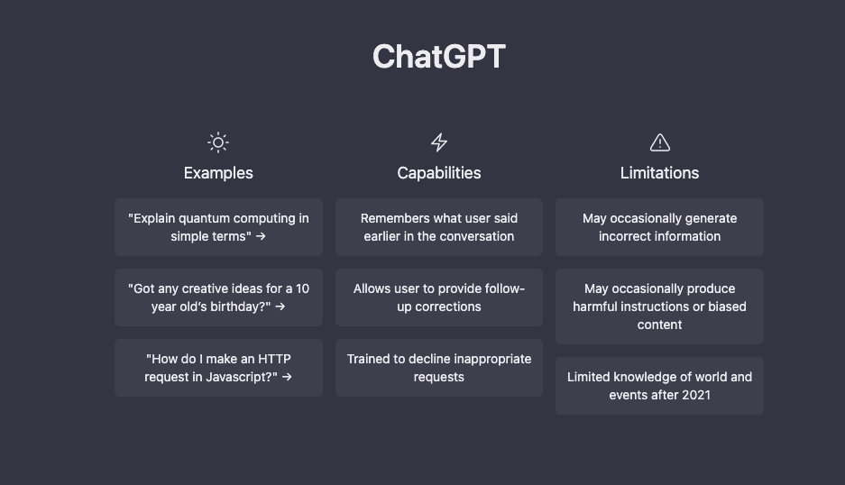

# Chat AI

This project uses the official Openai.com text-davinci-003 API to do Open ended conversation with an AI assistant!

See it in action: grace-ai.vercel.app

Created using Express, Node, Javascript, CSS

## Authors

👤 **Grace kabagher**

## Acknowledgments

- Adrian Hadjin

Other resources
https://beta.openai.com/examples
https://vercel.com/ - free hosting client
https://render.com/ - free hosting server

## 📝 License

This project is [MIT](./MIT) licensed.

## commands

npm start server 
npm start dev

